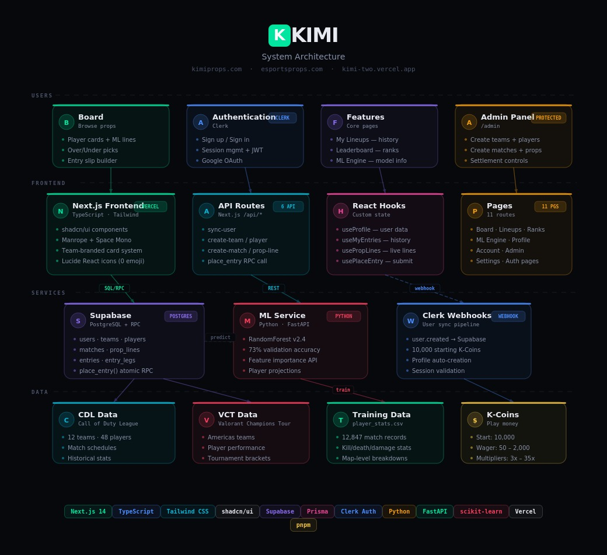

<div align="center">

# KIMI

### ML-Powered Esports Player Props

**[kimiprops.com](https://www.kimiprops.com)** · **[esportsprops.com](https://www.esportsprops.com)** · **[kimi-two.vercel.app](https://kimi-two.vercel.app)**

Pick Over/Under on player stat lines. Build 2-6 leg entries. Win K-Coins.

Play money only — no real currency.


<br />


<sub>Board view — CDL player cards with ML-projected stat lines and the entry slip builder</sub>

</div>

---

## What is KIMI?

KIMI is a full-stack esports prop betting platform (play money) for Call of Duty League and Valorant Champions Tour. Users browse ML-generated player stat lines, pick Over or Under, build multi-leg entries, and compete on a global leaderboard.

Think PrizePicks — but for esports, with a custom ML model generating every line.

## Features

**Board** — Browse upcoming CDL and VCT matches. Each player card shows ML-projected stat lines (kills, deaths, damage, assists) with confidence scores. Multiple props per player via expandable card sections.

**Entry Slip** — Select Over or Under on 2-6 props to build an entry. Multipliers scale from 3x (2 legs) to 35x (6 legs). Wager 50-2,000 K-Coins per entry.

**My Lineups** — Track all entries with status filters (Active, Won, Lost). Each entry expands to show individual leg results with visual hit/miss indicators.

**Leaderboard** — Global rankings by K-Coin balance, win rate, and entry volume. Podium display for top 3. Weekly, monthly, and all-time filters.

**ML Engine** — Transparency page showing model accuracy (73.2% on validation), feature importance breakdown, and live player projections with recent performance charts.

**Admin Panel** — Protected dashboard for managing teams, players, matches, and prop lines via API routes.

**Auth** — Clerk-powered sign up/sign in with automatic Supabase user sync. New users start with 10,000 K-Coins.

## Architecture

<div align="center">
  
  <br /><br />
  <sub>System architecture — Users → Frontend → Services → Data</sub>
</div>

<br />

The platform is organized into four layers:

**Users** — The board, auth flow, core feature pages (lineups, leaderboard, ML engine), and a protected admin panel.

**Frontend** — Next.js 14 app with TypeScript and Tailwind CSS. API routes handle user sync, team/player/match/prop creation, and entry placement via Supabase RPC. Zustand manages bet slip state. SWR handles data fetching.

**Services** — Supabase (PostgreSQL + RPC) for all persistent data, a Python ML service (RandomForest) for player projections, and Clerk webhooks for user sync with automatic K-Coin provisioning.

**Data** — CDL and VCT datasets (teams, players, schedules, historical stats), a training set of 12,847 match records, and the K-Coin economy (starting balance, wager limits, payout multipliers).

## Tech Stack

| Layer | Technologies |
|-------|-------------|
| Frontend | Next.js 14, React 18, TypeScript, Tailwind CSS, shadcn/ui, Radix UI |
| State & Data | Zustand (bet slip), SWR (data fetching), Framer Motion (animations) |
| Styling | Manrope + Space Mono fonts, Lucide React icons, team-branded color system |
| Auth | Clerk (sign up/in, session management, webhooks via Svix) |
| Database | Supabase (PostgreSQL + RPC functions) |
| ML | Python, scikit-learn (RandomForest), pandas, NumPy |
| Deployment | Vercel (frontend), Supabase (hosted DB) |
| Monorepo | pnpm workspaces |

## Project Structure

```
Kimi/
├── packages/
│   └── web/                       # Next.js frontend
│       ├── src/
│       │   ├── pages/             # 9 pages + 6 API routes
│       │   │   ├── index.tsx      # Board (main landing)
│       │   │   ├── entries.tsx    # My Lineups
│       │   │   ├── leaderboard.tsx
│       │   │   ├── ml.tsx         # ML Engine transparency
│       │   │   ├── admin.tsx      # Protected admin dashboard
│       │   │   ├── account.tsx    # User account
│       │   │   ├── profile.tsx    # User profile
│       │   │   └── api/           # sync-user, webhooks, admin CRUD
│       │   ├── components/        # PlayerCard, BetSlipV2, Nav, EntryCard, etc.
│       │   ├── hooks/             # useMatches, useProfile
│       │   ├── stores/            # slipStore (Zustand bet slip state)
│       │   ├── actions/           # placeEntry (server action)
│       │   ├── types/             # TypeScript type definitions
│       │   ├── lib/               # Supabase client
│       │   └── styles/            # globals.css (design tokens, component styles)
│       └── public/                # Favicon, OG images, screenshot
├── ml/                            # Python ML + data sync
│   ├── sync_matches.py            # PandaScore match sync
│   └── settle_matches.py          # Match result settlement
├── supabase/                      # Database migrations
│   └── migrations/                # 6 migration files (schema, RPC, auth)
└── .github/workflows/             # CI + weekly data sync
```

## Design System

- **Background**: `#080a0f` (deep black) with layered card surfaces
- **Accent**: `#00e5a0` (emerald green) — primary actions, OVER picks, success states
- **Red**: `#ff5c5c` — UNDER picks, losses
- **Gold**: `#f5c542` — K-Coin values, payouts
- **Team colors**: Each CDL/VCT team has a branded color applied to card accent bars, avatars, and selection states
- **Typography**: Manrope (UI) + Space Mono (stats/numbers)
- **Icons**: Lucide React — zero emojis

## ML Model

The prediction engine uses a RandomForest classifier trained on 12,847 historical match records.

**Features**: Historical kill average (last 10 matches), map type, opponent strength rating, recent form (last 3), home/away indicator, days since last match.

**Performance**: 73.2% accuracy on validation set, ±4.3 average kills deviation.

**Output**: For each player in an upcoming match, the model produces a projected stat line and confidence score (displayed on player cards).

## Getting Started

### Prerequisites
- Node.js 20+
- pnpm 8+
- Python 3.10+ (for ML service)

### Setup

```bash
# Clone
git clone https://github.com/JonathanDunkleberger/Kimi.git
cd Kimi

# Install dependencies
pnpm install

# Set up environment variables
cp packages/web/.env.example packages/web/.env.local
# Fill in: Clerk keys, Supabase URL/keys

# Run development server
pnpm dev
```

### Environment Variables

```env
NEXT_PUBLIC_CLERK_PUBLISHABLE_KEY=pk_...
CLERK_SECRET_KEY=sk_...
NEXT_PUBLIC_SUPABASE_URL=https://xxx.supabase.co
NEXT_PUBLIC_SUPABASE_ANON_KEY=eyJ...
SUPABASE_SERVICE_ROLE_KEY=eyJ...
```

## Live Demo

- **Primary**: [kimiprops.com](https://www.kimiprops.com)
- **Alternate**: [esportsprops.com](https://www.esportsprops.com)
- **Vercel**: [kimi-two.vercel.app](https://kimi-two.vercel.app)

All three domains serve the same application.

## License

This project is for portfolio and educational purposes only. Not affiliated with the Call of Duty League, Activision, Riot Games, or any esports organization.
