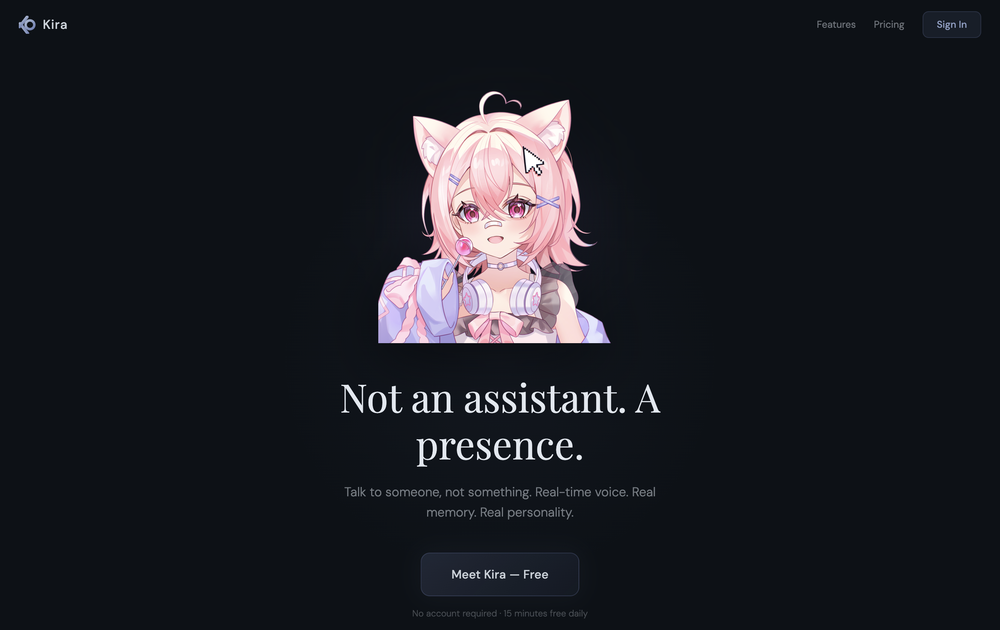

# Kimi



Esports fantasy props platform for **Valorant (VCT)** and **Call of Duty (CDL)**. Real match data from PandaScore, player prop lines with ML confidence indicators, and a parlay-style entry system — all running on Supabase + Vercel with zero backend servers.

## Architecture

```
┌──────────────┐     ┌──────────────────┐     ┌──────────────┐
│   Vercel      │     │    Supabase       │     │  PandaScore  │
│  (Next.js)    │────▶│  Postgres + Auth  │◀────│     API      │
│  Frontend     │     │  RLS policies     │     │  (VCT + CDL) │
└──────────────┘     └──────────────────┘     └──────────────┘
                                                      ▲
                                               ┌──────┴───────┐
                                               │ GitHub Actions│
                                               │ Weekly Cron   │
                                               └──────────────┘
```

| Layer | Technology | Purpose |
|-------|-----------|---------|
| Frontend | Next.js 14, React 18, Tailwind CSS v4, Zustand | UI, auth, bet slip |
| Database | Supabase (Postgres) | Teams, players, matches, prop lines, entries, auth |
| Auth | Supabase Auth | Sign up / sign in, profiles, balances |
| Data Pipeline | Python + PandaScore API | Sync VCT + CDL matches, rosters, prop lines |
| Hosting | Vercel | Frontend deployment |
| Automation | GitHub Actions | Weekly match sync cron (Mondays 6am UTC) |

## Features

- **Dual-game support** — Valorant (VCT) and Call of Duty (CDL) with tab switching
- **Real match data** — Upcoming and live matches from PandaScore, filtered to professional leagues only
- **Player prop lines** — Map-scoped kills, assists, deaths, damage with ML confidence (no ambiguous totals)
- **Parlay entries** — Build multi-leg over/under entries from the bet slip
- **User accounts** — Sign up, track balance, view entry history, win/loss streaks
- **Admin panel** — Manual match/team/player/prop creation
- **Leaderboard** — Top users by profit
- **ML insights page** — View model confidence and direction indicators
- **Auto-updating** — GitHub Actions syncs new matches every Monday

## Project Structure

```
packages/web/           Next.js frontend (deployed to Vercel)
  src/pages/              Pages (index, entries, profile, account, admin, leaderboard, ml)
  src/components/         UI components (MatchCard, BetSlip, Layout, etc.)
  src/hooks/              Data hooks (useMatches, usePropLines, useLeaderboard, etc.)
  src/stores/             Zustand stores (authStore, slipStore, toastStore)
  src/lib/                Supabase client, utils
  src/types/              TypeScript types

ml/                     Python data pipeline
  sync_matches.py         Weekly sync — VCT + CDL matches, rosters, prop lines
  settle_matches.py       Settle completed matches via PandaScore results

supabase/migrations/    Database schema
  000_full_setup.sql      Core schema (teams, players, matches, prop_lines, entries, etc.)
  007_pandascore_ids.sql  PandaScore ID columns for data linking

.github/workflows/
  weekly-sync.yml         Cron: runs sync_matches.py every Monday
```

## Getting Started

### Prerequisites

- Node.js 20+, pnpm 9+
- Python 3.11+
- Supabase project ([supabase.com](https://supabase.com))
- PandaScore API token ([pandascore.co](https://pandascore.co)) — free tier works

### 1. Clone and install

```bash
git clone https://github.com/JonathanDunkleberger/Kimi.git
cd Kimi
pnpm install
```

### 2. Set up Supabase

Run the migrations in order via the Supabase SQL Editor:

```
supabase/migrations/000_full_setup.sql
supabase/migrations/007_pandascore_ids.sql
```

### 3. Configure environment

Create `packages/web/.env.local`:

```env
NEXT_PUBLIC_SUPABASE_URL=https://your-project.supabase.co
NEXT_PUBLIC_SUPABASE_ANON_KEY=your-anon-key
```

Create `.env` (root, for Python scripts):

```env
NEXT_PUBLIC_SUPABASE_URL=https://your-project.supabase.co
SUPABASE_SERVICE_ROLE_KEY=your-service-role-key
PANDA_SCORE_TOKEN=your-pandascore-token
```

### 4. Sync match data

```bash
pip install requests python-dotenv supabase
python ml/sync_matches.py
```

This fetches this week's VCT and CDL matches, team rosters, and generates prop lines.

### 5. Run the frontend

```bash
cd packages/web
pnpm dev
```

Visit [http://localhost:3000](http://localhost:3000).

## Deployment

**Frontend** is deployed to **Vercel** from the `packages/web` directory. Set these env vars in Vercel:

- `NEXT_PUBLIC_SUPABASE_URL`
- `NEXT_PUBLIC_SUPABASE_ANON_KEY`

**Weekly sync** runs via GitHub Actions. Add these as repository secrets:

- `NEXT_PUBLIC_SUPABASE_URL`
- `SUPABASE_SERVICE_ROLE_KEY`
- `PANDA_SCORE_TOKEN`

The sync runs automatically every Monday at 6am UTC. You can also trigger it manually from the Actions tab.

## Data Pipeline

`ml/sync_matches.py` does the following each week:

1. Fetches upcoming + live matches from PandaScore for VCT (league 4531) and CDL (league 4304)
2. Filters to the current week (Monday-Sunday)
3. Batch-fetches team rosters (one API call per unique team, cached)
4. Upserts teams, players, matches, and events into Supabase
5. Generates prop lines with deterministic stat projections and ML confidence indicators

## Database

Key tables:

| Table | Purpose |
|-------|---------|
| `teams` | Team name, abbreviation, logo, game |
| `players` | Player IGN, real name, photo, role, team |
| `matches` | Two teams, start time, status, game, event |
| `prop_lines` | Player + match + stat type + line value + ML confidence |
| `entries` | User parlay entries with stake and payout |
| `entry_legs` | Individual over/under picks within an entry |
| `profiles` | User balance, wins, losses, streak |

Key RPC functions:

- `deduct_credits(user_id, amount)` — Atomic balance deduction
- `settle_prop_line(prop_line_id, actual_result)` — Score line, update legs and entries, credit winners

## License

MIT — see [LICENSE](LICENSE).

## Disclaimer

This platform is for educational and experimental purposes only. Not affiliated with Riot Games, Activision, or any esports league.
