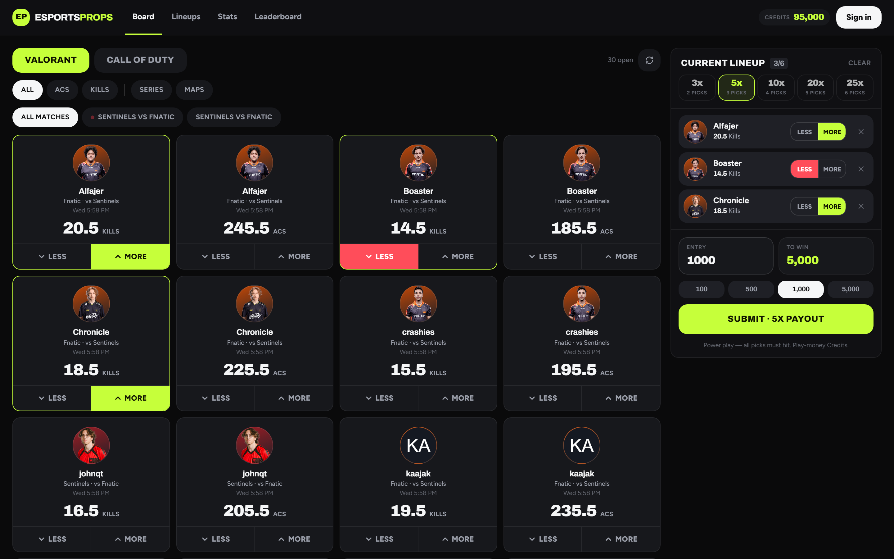
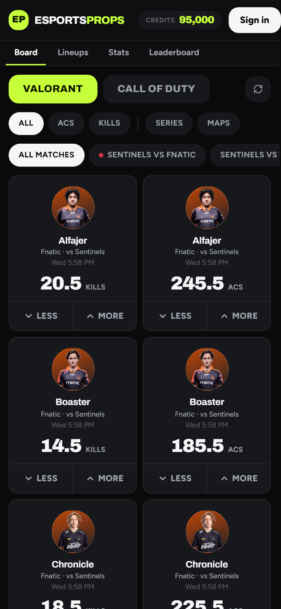
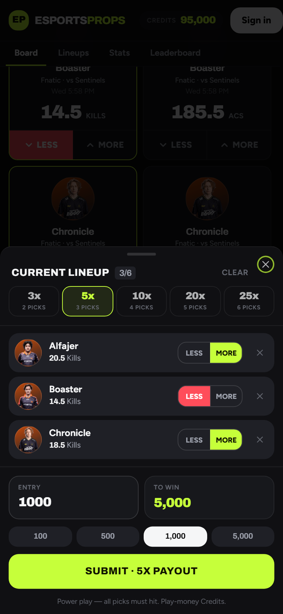
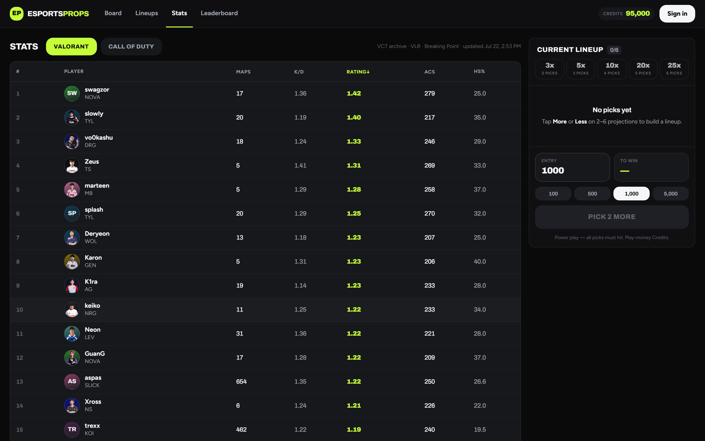
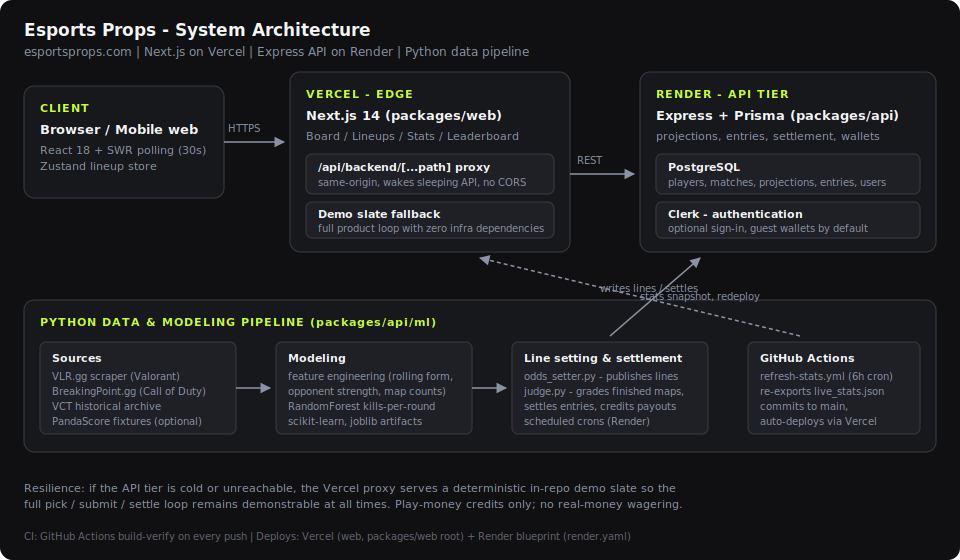

<div align="center">

# Esports Props

**Daily-fantasy player props for competitive Valorant and Call of Duty.**

Live at **[esportsprops.com](https://www.esportsprops.com)**




</div>

---

## Overview

Esports Props is an end-to-end, production-deployed pick'em product: users browse
statistical projections for professional esports players ("TenZ 22.5 Kills"),
pick **More** or **Less** on 2-6 of them, and submit a lineup whose payout
multiplier scales with the number of legs. It follows the interaction grammar
established by market leaders in the DFS category (PrizePicks, Underdog) and
applies it to two underserved verticals: **Valorant (VCT)** and **Call of Duty
(CDL)**.

The platform is intentionally **play-money only**. Users receive a
100,000-credit wallet (no sign-up required); authentication is optional and
persists the wallet across devices. This keeps the product outside real-money
gaming regulation while preserving the complete product loop: line generation,
board merchandising, lineup building, entry settlement, and leaderboards.

The project covers the full product surface: market and interaction research,
a design system, a statistical modeling pipeline that sets the lines, a
transactional entry/settlement backend, and a zero-downtime deployment story on
an owned domain.

## Product at a glance

| Mobile board | Lineup builder |
|:---:|:---:|
|  |  |

| Stats hub (desktop) |
|:---:|
|  |

## Key product decisions

**Category-standard interaction model.** The More/Less split card, the 2-6 leg
lineup, and the multiplier ladder are established conventions that users
already understand. The product deliberately matches that grammar one-for-one
rather than inventing a new one, and differentiates on vertical (esports
titles), density, and visual identity.

**Single-title boards.** Valorant and Call of Duty are exclusive top-level
tabs, mirroring how sportsbooks treat sports. Audience research on esports
communities shows minimal overlap between the two fanbases; a blended board
optimizes for neither.

**Guest-first onboarding.** The highest-friction step in any picks product is
registration before value delivery. Here the full loop - browse, pick, submit,
settle - works for anonymous users with a device-scoped wallet. Sign-in is
positioned as wallet persistence, not a gate.

**Map-gated live markets.** Esports series are sequential (best-of-3 /
best-of-5), so naive prop listing creates dead markets. Availability logic
locks series props at match start, opens Map 1 until it begins, and unlocks Map
N only after Map N-1 completes *and* only if the series still requires that
map. Live matches carry a LIVE badge and in-progress state on every card.

**Graceful degradation as a product feature.** The board must demo perfectly at
all times - to a recruiter, an investor, or a user - regardless of whether the
free-tier API instance is warm. A same-origin proxy falls back to a
deterministic in-repo slate that exercises every product state (scheduled,
live, locked, settled).

## Game mechanics

| Legs | Multiplier | Implied per-leg break-even |
|:---:|:---:|:---:|
| 2 | 3x | 57.7% |
| 3 | 5x | 58.5% |
| 4 | 10x | 56.2% |
| 5 | 20x | 54.9% |
| 6 | 25x | 58.5% |

- Entries require 2-6 picks; the store blocks a seventh pick with a toast.
- Power-play rules: **all legs must hit**; pushes settle as losses.
- Every projection carries scope (full series or a specific map) and locks
  independently based on match state.

## System architecture

<div align="center">

</div>

**Web (packages/web).** Next.js 14 + TypeScript on Vercel. Tailwind CSS v4
design system (dark-only, dense card grid, tabular numerals), Zustand for
lineup state, SWR for 30-second board polling. A catch-all API route proxies
`/api/backend/*` to the API tier - same-origin (no CORS), wakes the free-tier
instance, and serves the demo slate on failure.

**API (packages/api).** Express + Prisma over PostgreSQL. Endpoints for
projections, entry creation (server-side validation of leg counts, balances,
and lock state), settlement, wallets, stats, and leaderboards. Clerk handles
optional authentication; guests are keyed by device token.

**Data pipeline (packages/api/ml).** Python. Scrapers ingest Valorant
leaderboards from VLR.gg and Call of Duty season aggregates from
BreakingPoint.gg, merged with a local VCT historical archive. A scikit-learn
RandomForest model (kills-per-round) built on engineered features (rolling
form, opponent strength, map counts) feeds `odds_setter.py`, which publishes
lines; `judge.py` grades completed maps and settles entries on a cron. A
GitHub Actions workflow re-exports the stats snapshot every six hours and
commits it, which redeploys the site automatically.

## Repository structure

```
.
|- .github/workflows/     CI build-verify + 6-hourly stats refresh
|- docs/                  Screenshots and architecture diagram
|- packages/
|  |- web/                Next.js app (Vercel project root)
|  |  |- src/components/  Board, lineup slip, layout shell
|  |  |- src/lib/demo/    Deterministic demo slate + board API
|  |  '- src/pages/       Board, Lineups, Stats, Leaderboard, Account
|  '- api/                Express + Prisma service (Render)
|     |- src/             Routes, availability logic, multipliers
|     |- prisma/          Database schema
|     '- ml/              Scrapers, model training, line setting, settlement
'- render.yaml            API + cron blueprint (Render)
```

## Local development

```bash
pnpm install

pnpm dev:web     # web on :3000 (uses demo slate without an API)
pnpm dev:api     # optional API on :4000

pnpm --filter @app/web build   # production build check
```

The web app runs fully standalone against the demo slate - no database,
API keys, or Python environment required. To run the live data path, see
`packages/api/ml/README.md` and `.env.example`.

## Quality and operations

- **CI:** every push builds both workspaces (`.github/workflows/ci.yml`).
- **Release verification:** UI changes are validated with a scripted
  Playwright pass covering board density, pick selection, the lineup sheet,
  submission, tab exclusivity, and the six-leg cap - at mobile and desktop
  viewports - before merging to `main`.
- **Deployment:** `main` auto-deploys to Vercel (web) and Render (API +
  settlement crons via `render.yaml`).
- **Scheduled data:** GitHub Actions refreshes player statistics every six
  hours with a bot commit, keeping the Stats hub current without manual
  operations.

## Roadmap

- Flex-play payout tables (partial-hit lineups)
- Live in-match projection re-pricing
- Additional titles (League of Legends, Counter-Strike)
- Model upgrades: gradient boosting, per-map priors, opponent-adjusted lines

## Responsible play

Esports Props uses virtual credits with no cash value, no purchases, and no
withdrawals. It is a product and engineering portfolio piece, not a gambling
service.

## License

MIT - see [LICENSE](LICENSE).
